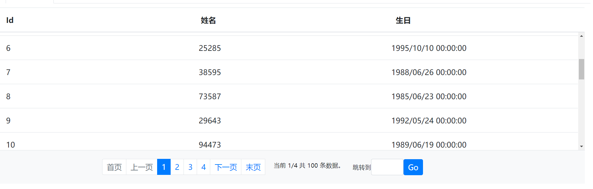

# BootBlazorUI
BootBlazorUI 是基于 Bootstrap 4.x 版本并构建于 ASP.NET CORE 3.1 的 UI 库，不依赖于 JQuery 和 Bootstrap.js 实现所有交互，可应用于 Mvc / Razor Page / Blazor 等 Web 应用程序。BootBlazorUI 更偏向于交互和实用性，而不仅仅是静态的组件。

BootBlazorUI 更偏向于交互性和实用性，而不仅仅是静态的组件。

# 特性
* 依托于 VS 的强大 IDE，如同使用 HTML 组件一样容易使用这些组件；
* 简单易用，让那些对 UI 并不擅长的程序员也能轻而易举的构建出想要的组件功能，再也不用去记那些 Bootstrap 组件的样式；
* 教科书般的注释，每一个参数都有很清晰的注释，形成注释即文档（Code As A Document）的风格；
* 组件分为基础组件和集成组件。集成组件是将多个基础组件组合起来，形成更为强大的组件；
* 开源、免费，并且不断更新丰富内容；

# 支持环境
* .NET CORE 3.1+ SDK
* .NET Standard 2.0+

# 最新版本（v0.5.0）
> Install-Package BootBlazorUI

# 快速上手
* 使用 Nuget Package Manager 安装包：`> Install-Package BootBlazorUI`；
* 引入内置的 bootstrap 样式 `<link href=_content/BootBlazorUI/bootstrap.min.css" rel="stylesheet/>` ，或你也可以自己引入 bootstrap 的样式；
* 引入组件样式：`<link href="_content/BootBlazorUI/components.css" rel="stylesheet" />`
* 引入所需的脚本：`<script src="_content/BootBlazorUI/components.js"></script>`；
* 使用 `@using BootBlazorUI` 引入命名空间，你可以在 `_Import.cshtml`(Mvc/Razor Page) | `_Import.razor`(Blazor) 中引入全局命名空间，或在某个页面中引入命名空间；


# Demo 演示
### [在线文档](http://101.133.155.72/)

## 按钮（Buttons）

```html
<Button Color="Color.Primary">Primary</Button>
<Button Color="Color.Secondary">Secondary</Button>
<Button Color="Color.Info">Info</Button>
<Button Color="Color.Warning">Warning</Button>
<Button Color="Color.Success">Success</Button>
<Button Color="Color.Danger">Danger</Button>
<Button Color="Color.Light">Light</Button>
<Button Color="Color.Dark">Dark</Button>
```
## 进度条（Progress Bar）

```html
<ProgressBar Value="80" Color="Color.Primary" />
<ProgressBar Value="65" Color="Color.Secondary" />
<ProgressBar Value="30" Color="Color.Info" />
<ProgressBar Value="77" Color="Color.Warning" />
<ProgressBar Value="100" Color="Color.Success" />
<ProgressBar Value="40" Color="Color.Danger" />
<ProgressBar Value="92" Color="Color.Light" />
<ProgressBar Value="50" Color="Color.Dark" />
```

## 对话框

```html
<Button OnClick="@(() => modal.Open())"/>
弹出模态框
</Button>

<Modal @ref="modal">
    <HeaderTemplate>
        对话框标题
    </HeaderTemplate>
    <BodyTemplate>
        显示了一个对话框的内容
    </BodyTemplate>
</Modal>

@code{
Modal modal = new Modal();
}
```

## 徽章

```html
<Badge Color="Color.Primary">Primary</Badge>
<Badge Color="Color.Secondary">Secondary</Badge>
<Badge Color="Color.Info">Info</Badge>
<Badge Color="Color.Success">Success</Badge>
<Badge Color="Color.Warning">Warning</Badge>
<Badge Color="Color.Danger">Danger</Badge>
<Badge Color="Color.Light">Light</Badge>
<Badge Color="Color.Dark">Dark</Badge>
```
## 数据表格

```html
<BootDataGrid DataBind="page => LoadData(page,25)" FixHeader="true" RowFixHeight="300" TotalRecordCount="totalCount" ShowPagination="true" PageSize="25">
    <BootDataGridColumn Title="Id" Field="Id" />
    <BootDataGridColumn Title="姓名" Field="Name" />
    <BootDataGridColumn Title="生日" Field="Birthday" />
</BootDataGrid>
```